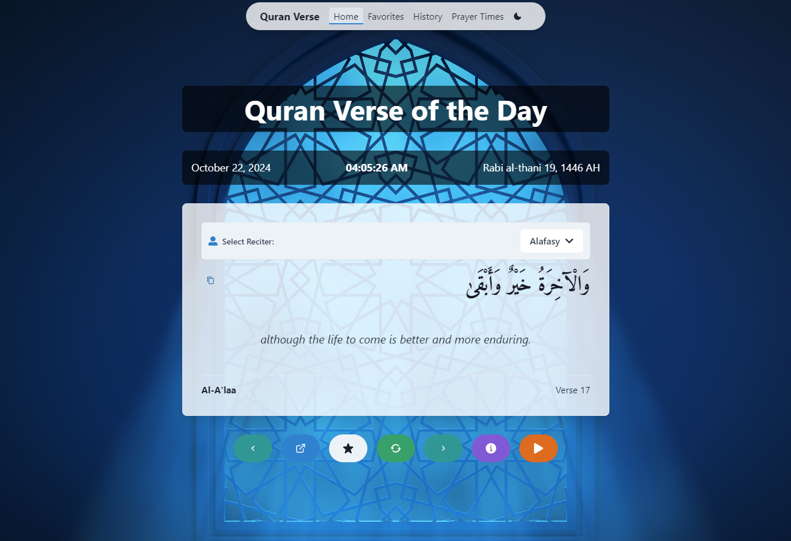

# Quran Verse Website

A Next.js-based web application that displays random Quran verses, allows users to explore specific verses, and provides features like favorites, history, tafsir (interpretation), and prayer times.

## Features

- Display random Quran verses with translations
- Navigate through verses
- Save favorite verses
- View verse history
- Read tafsir (interpretation) for verses
- Customizable Islamic-themed backgrounds
- Audio recitation of verses with multiple reciters
- Prayer times for London, UK
- Responsive design for various screen sizes
- Dark mode support

## Technologies Used

- Frontend:
  - Next.js
  - React
  - Chakra UI
  - Axios
  - Moment.js (with Hijri calendar support)

- Backend:
  - Node.js
  - Express
  - MongoDB (with Mongoose)
  - Axios for external API calls

## Getting Started

### Prerequisites

- Node.js (v14 or later)
- npm or yarn
- MongoDB

### Installation

1. Clone the repository:
   ```
   git clone https://github.com/your-username/quran-verse-website.git
   cd quran-verse-website
   ```

2. Install dependencies for the frontend:
   ```
   npm install
   ```

3. Navigate to the backend directory and install dependencies:
   ```
   cd quran-verse-backend
   npm install
   ```

4. Create a `.env` file in the backend directory and add your MongoDB connection string:
   ```
   MONGODB_URI=your_mongodb_connection_string
   ```

### Running the Application

1. Start the backend server:
   ```
   cd quran-verse-backend
   npm run dev
   ```

2. In a new terminal, start the frontend development server:
   ```
   cd ..
   npm run dev
   ```

3. Open your browser and visit `http://localhost:3000`

## Project Structure

- `src/pages`: Next.js pages
- `src/components`: React components
- `src/styles`: CSS styles
- `src/config`: Configuration files
- `quran-verse-backend`: Backend server code

## API Routes

- `/api/verses/random`: Get a random verse
- `/api/verses/:surahNumber/:verseNumber`: Get a specific verse
- `/api/verses/history`: Get verse history
- `/api/verses/reciters`: Get list of available reciters

## New Features

1. **Audio Recitation**: Users can now listen to audio recitations of verses with multiple reciter options.
   ```typescript:quran_verse_website/src/pages/index.tsx
   startLine: 44
   endLine: 66
   ```

2. **Prayer Times**: A new page displaying daily prayer times for London, UK.
   ```typescript:quran_verse_website/src/pages/prayer-times.tsx
   startLine: 1
   endLine: 34
   ```

3. **Tafsir Modal**: Users can now read interpretations (tafsir) of verses from various scholars.
   ```typescript:quran_verse_website/src/components/TafsirModal.tsx
   startLine: 1
   endLine: 108
   ```

4. **Dark Mode**: The application now supports dark mode for better user experience in low-light conditions.
   ```typescript:quran_verse_website/src/pages/_app.tsx
   startLine: 6
   endLine: 20
   ```

5. **Responsive Header**: A new responsive header with a hamburger menu for mobile devices.
   ```typescript:quran_verse_website/src/components/Header.tsx
   startLine: 56
   endLine: 120
   ```

6. **Verse Navigation**: Users can now navigate to the next and previous verses.
   ```typescript:quran_verse_website/src/pages/index.tsx
   startLine: 204
   endLine: 216
   ```

7. **Copy Verse**: A new feature to copy the current verse to the clipboard.
   ```typescript:quran_verse_website/src/pages/index.tsx
   startLine: 262
   endLine: 284
   ```

## Contributing

Contributions are welcome! Please feel free to submit a Pull Request.

## License

This project is open source and available under the [MIT License](LICENSE).

## Acknowledgements

- [Quran API](https://alquran.cloud/api) for providing Quran data
- [Quran Tafseer API](http://api.quran-tafseer.com/) for tafsir data
- [Aladhan API](https://aladhan.com/prayer-times-api) for prayer times data